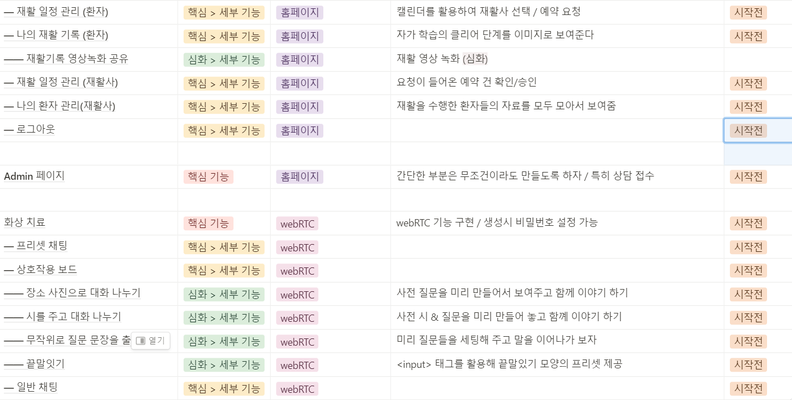
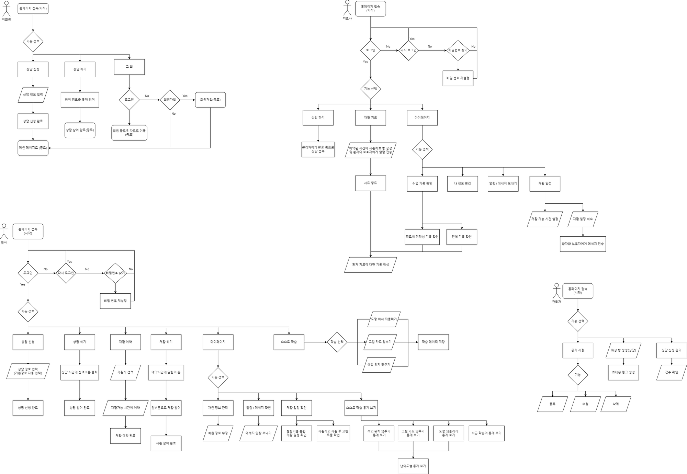
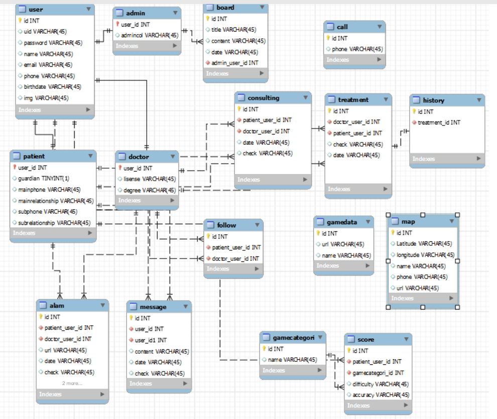

# 팀 규칙 / 콘벤션 / 정리

핵심 => 부가기능 => 심화기능 :: 단계를 나누자

**매일 회의록 만들기**

**명세서** 세세하게 120% 적고 80% 구현한다는 느낌으로
**기능 명세서 ⇒** 우선순위 적용
**테스트 목록 ⇒** 개발 말기에 리스트 만들고 점검

매일 아침 간단한 회의 하기

오후 5시에 git 합치고 Jira 오후에 같이 내일 것 보수하기

중간에 힘들어 보이면 팀 리후레쉬 시간 열기

9 to 6 // 2주 전까지

매주 월요일 12시 40분 컨설턴트님 코칭

webRTC 툴 - 오픈비두 / 명세서에 있는거 뭐할지 선택 + HTTPS설정해야하고

- 참관 비밀번호 부여
- 화상치료 시 - 상담사 권한부여 기능 (보기만 / 채팅까지)

백 / 프론트 각자 공부한거 스터디 (1주차)

배포 공부 및 스터디(2주차 이후)

10층 회의실 이용할 수 있음

설연휴기간 → 배포 공부

1월 25일 배포

2월 10일 마감 (노력!)

- 기본적인 아이디어들 정리되면 프론트는 목업, 백은 테이블 + API 설계하기

---

# 1. Conventions

---

### - Git 메세지 컨벤션

> [prefix]: [type] #issue 제목

- Prefix - `FE / BE / COMMON`
- Type
  | Type | 설명 |
  | -------- | ------------------------------------------------------------------------------------ |
  | FEAT | new feature : 새로운 기능 생성 |
  | FIX | bug fix |
  | REFACTOR | refactoring production code : 코드 리펙토링 |
  | STYLE | formatting, missing semi colons, etc; no code change : 코드 스타일 수정(컨벤션 관련) |
  | DOCS | changes to documentation : ReadMe같은 문서 수정 |
  | CHORE | updating grunt tasks etc. no production code change : 기타 코드는 고치지 않는 잡일 |
  | TEST | test code |
  | STUDY | personal study code |
  EX)

  > [BE] : [FEAT] Jwt 토큰 생성 기능 구현

  > [FE] : [FEAT] 서비스 안내 페이지 HTML CSS 완성 // 데이터 처리는 구현 중

  > [COMMON] : [STUDY] 1주차 회원가입 기능 구현

- 규칙
  - 제목은 전체 내용을 간결하게 요약할 것.
  - 함수 기반의 커밋을 진행하며, 함수 작성 이유를 담을 것.
  - 함수가 사용된 기능 및 관련 기능을 밝힐 것.
  - 내용은 한글로 작성한다.

> 권한을 막아 놓기는 했지만 **반드시 새로 브랜치를 파고** push 한 뒤 팀장/부팀장에게 Merge Request를 깃랩에서 직접 요청하기!!

### - Git Branch 전략

| 분류   | 설명                                            |
| ------ | ----------------------------------------------- |
| master | 실제로 배포한 안정적인 버전                     |
| dev    | 개발 완료한 기능이 포함된 상태                  |
| hotfix | 긴급한 오류 수정 시 master 브랜치의 직속 브랜치 |
| study  | 개인용 제출 브랜치, master에 머지 안함          |
| source | 기타 자료 보관용 저장소 브랜치                  |

---

### - 프론트 컨벤션

- let, const로 변수 선언하기

- 변수, 함수명 모두 Camel Case로 작성

- CSS의 경우 **[페이지 or 컴포넌트 이름].module.css** 를 활용
  CSS 모듈을 사용해서 각자 class 이름은 겹쳐도 상관없으니 편한대로 작명

- CSS 파일의 경우 해당하는 컴포넌트 / 페이지 폴더 안에 JSX파일과 함께 생성한다.

- 동적 페이지를 위한 Grid 레이아웃은 공통적으로 BootStrap의 Class 사용
  ”**md**(768≤ : 테블릿 화면), **lg**(960px≤ : 데스크탑 화면) 명만 사용 → 모바일은 별도 grid X”

- **Boolean 변수**는 “is”로 시작하기

- JSX 파일 구조에서 변수 - 함수 - useEffet - HTML 순으로 구성하기. Styled Components를 사용시 useEffect 다음 부분에 만들어서 사용하기. 각 부분은 // 변수 // 함수 // useEffect 식으로 구분해 주기.

- 함수와 변수를 작성 할 때 **주석**으로 무엇에 활용하는 용도인지 간단하게 적어주기

- 메인 함수 제외하고는 모두 화살표 함수로 표기

- Redux의 initialState를 바꾸는 변경함수는 chang변수명(Camel 케이스) 규칙을 적용 하자.
  ps. 참고로 Redux의 상태변경 함수(Slice)안에서는 ajax(우린 axios 활용)사용하면 안된다.
  통신은 전부 Component안에서 수행해야 하며 아마 대부분 useEffect 훅에서 사용 될 예정.

- 프론트의 스켈레톤 코드 : 페이지 별로 분할, 각 페이지의 별로 또 컴포넌트 폴더를 분할,
  각 페이지 or 기능을 중심으로 redux store를 분할, axios를 수행할 통신 기능을 분할,
  서버에 요청시 자동으로 해더에 쿠키(JWT or 세션쿠키) 달아주는 custom axios

* 각 store를 중심으로 별도의 axios용 함수들을 모아 놓는 클래스 파일 모듈화

---

### - 백엔드 컨벤션

- 의존성 주입방법 : 생성자 주입

- 로그 기록 방식
  `LOGGER.info("[loadUserByUsername] loadUserByUsername 수행. username : {}", username);`

- dto, entity 네이밍
  ex) UserDto(요청dto), UserResponseDto(응답dto), User(entity)
  → 단 요청과 응답이 다르지 않을경우 UserDto로 통일

- 객체생성시 setter 로할지 builder 로할지

- CRUD 메소드 네이밍

---

# 2. Planning

---

### - 프로젝트 명세서 (일단 백엔드만)

- SpringBoot 2.5.6
  - Spring Security
  - Spring Data JPA
  - Lombok
  - swagger (차후 수정)
  - mysql driver
  - spring web
  - spring configuration processor
  - jjwt 0.9.1
- MySQL 8.0.31
- API 통합 테스트 툴 : postman

---

### 아이디어 기능정리

### FlowChart

### ERD 다이어그램

---

### API 명세서 (준비중)

---

# 3. Design & MookUp

---

- 거의 마무리 단계. 나중에 이미지화해서 옮길 예정
  https://ramen-buang.notion.site/Mock-Up-Figma-695ed13d97654180bce7212121bcadfc

---

## 프로젝트 노션

https://ramen-buang.notion.site/SSAFY-2-1-4c60153fe8824115a14fcdabecdd8169
