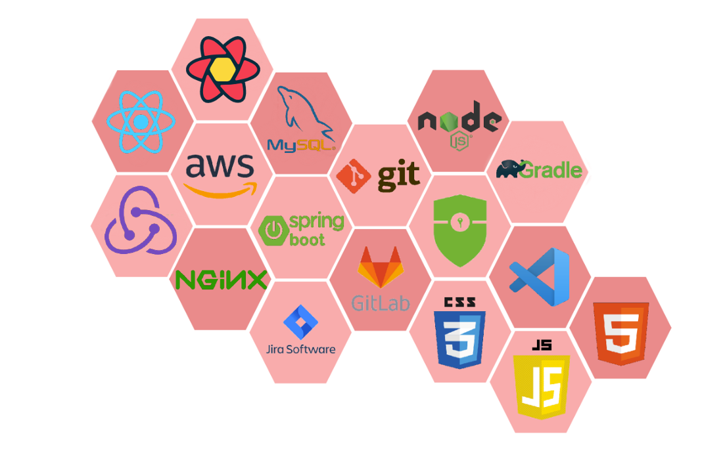
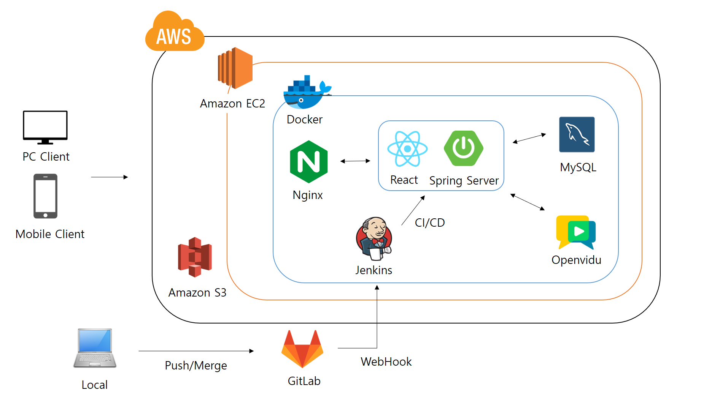

# <center>🏃‍♂️ Marathon 🏃‍♀️</center>


- ### 프로젝트 개요

  - 🏠 [Marathon Homepage](https://i8a304.p.ssafy.io/)

  - `Marathon` 는 누구나 합리적인 비용으로 언어치료 기회를 누릴 수 있도록
    의사소통 전문가를 온라인으로 연결하는 원격 언어 재활 웹서비스입니다.

- ### 주요 기능

  - **Patient Service**

    > - 비회원, 회원 모두 무료상담신청이 가능합니다.
    > - 원하는 재활사를 선택하고 원하는 시간에 재활시간을 등록합니다.
    > - 재활시간이 되면 알림으로 접속가능한 링크를 안내합니다.
    > - 재활이 매칭된 재활사에게 메세지를 보낼 수 있습니다.
    > - 재활진료가 끝나면 영상이 저장되고, 기록을 재활기록페이지에서 확인합니다.
    > - 스스로학습 페이지를 통해 3가지 게임을 난이도에 맞춰 실행하고 기록을 마이페이지에서 확인합니다.

  - **Doctor Service**

    > - 재활사는 재활치료가 가능한 시간을 등록합니다.
    > - 재활이 매칭된 환자에게 메세지를 보낼 수 있습니다.
    > - 수업에 대한 피드백 작성 지원 및 여러 재활일정을 효율적으로 관리하도록 지원합니다.

  - **Admin Service**

    > - 관리자는 공지사항을 등록, 수정, 삭제합니다.
    > - 관리자는 상담신청을 관리하고 화상 상담방을 개설하여 재활사와 환자의 서비스 이용을 촉진합니다.

## 📌 목차

[🏃‍♂️ Marathon 🏃‍♀️](#marathon)

- [시작하기](#-시작하기)
  - [시작하기에 앞서](#시작하기에-앞서)
  - [설치하기](#설치하기)
  - [실행하기](#실행하기)
  - [배포하기](#배포하기)
  - [데모](#데모)
- [지원하는 브라우저](#-지원하는-브라우저)
- [사용된 도구](#-사용된-도구)
- [사용된 기술](#-사용된-기술)
- [저자](#-저자)
- [라이센스](#-라이센스)

## 🏃 시작하기

아래 방법을 따르시면 프로젝트를 실행시킬 수 있습니다.

### 시작하기에 앞서

- [Windows 10](https://www.microsoft.com/en-us/software-download/windows10)
- [Zulu 11](https://www.azul.com/downloads-new/?package=jdk#zulu)
- [Node.js 12.8.1](https://nodejs.org/ko/download/)
- [MySQL 8.0](https://www.mysql.com/downloads/)

### 설치하기

1. 깃랩의 레포지토리를 클론합니다.

   ```
   $ git clone https://lab.ssafy.com/s08-webmobile1-sub2/S08P12A304.git
   ```

2. npm을 설치합니다.

   ```
   $ npm install
   ```

### 실행하기

`Marathon` 서비스를 사용하기 위해서는 다음과 같은 방법으로 실행합니다:

1. 데이터베이스를 설정합니다.

   - [marathon.sql](https://lab.ssafy.com/s08-webmobile1-sub2/S08P12A304/-/blob/dev/Docs/marathon.sql)을 참고해서 데이터베이스를 생성합니다. ([여기](https://lab.ssafy.com/s08-webmobile1-sub2/S08P12A304/-/blob/dev/Docs/marathon_ERD.png)를 눌러 erd를 확인하세요.)

   - `application.properties`에 데이터베이스 설정을 추가합니다.

     ```
     spring:
       datasource:
         driver-class-name: com.mysql.cj.jdbc.Driver
         url : jdbc:mysql://localhost:3306/marathon?characterEncoding=UTF-8&serverTimezone=Asia/Seoul
         username : {데이터베이스 계정 아이디}
         password : {데이터베이스 계정 비밀번호}
     ```

2. 백엔드 서버를 실행합니다.

   - IDE에 import 후 실행합니다.

     : IntelliJ, STS와 같은 IDE를 사용하는 경우, `Backend`를 import하여 실행합니다.

   - jar파일을 생성 후 실행합니다.

     ```
     $ gradlew build
     ```

     ```
     $ java -jar [filename].jar
     ```

3. 프론트엔드 모듈 설치 후 실행합니다.

```
	$ npm i (혹은 npm install)
	설치 오류 발생 시 $npm install --force 로 강제 설치
    $ npm start
```

### 배포하기

해당 서비스는 `AWS EC2`를 이용하여 배포하였습니다. 사전에 [여기](https://victorydntmd.tistory.com/61)를 참고해서 `AWS EC2`계정을 생성하세요.

배포를 하기위해서는 다음과 같은 방법으로 실행합니다:

1. AWS EC2 인스턴스 생성

2. Ubuntu 환경에 Git Clone

3. Nginx 환경 설정

```
   events {

		}

		http {
		        client_max_body_size 50M;

		        include mime.types;

		        upstream front {
		                server front-app:9443;
		        }
		        upstream back {
		                server back-app:4433;
		        }

		        server {
		                listen 80;

		                location /.well-known/acme-challenge/ {
		                        root /var/www/certbot;
		                }
		                location / {
		                        return 301 https://$host$request_uri;
		                }

		        }

		        server {
		                listen 443 ssl;

		                ssl_certificate /etc/letsencrypt/live/i8a304.p.ssafy.io/fullchain.pem;
		                ssl_certificate_key /etc/letsencrypt/live/i8a304.p.ssafy.io/privkey.pem;
		                include /etc/letsencrypt/options-ssl-nginx.conf;
		                ssl_dhparam /etc/letsencrypt/ssl-dhparams.pem;

		                location / {
		                        proxy_pass https://front;
		                }
		                location /api {
		                        proxy_pass https://back;
		                }
		        }
		}
```

4. JDK 설치 (환경변수 설정)

5. DB 설치 (해당 프로젝트에서 MySQL 사용)

6. gradle wrapper을 위한 버전 설정 (6.0.0 이상)

7. gradle clean build 실행 (jar 파일 생성)

8. npm build (dist 폴더 생성)

### 데모

[여기](https://i8a304.p.ssafy.io)를 클릭하세요.

## 🌐 지원하는 브라우저

|  |  |  |  |
| :-----------------------------------------------------------------------------------------------------------------------: | :-----------------------------------------------------------------------------------------------------------------------: | :-----------------------------------------------------------------------------------------------------------------------: | :-----------------------------------------------------------------------------------------------------------------------: |
|                                                          latest                                                           |                                                          latest                                                           |                                                          latest                                                           |                                                          latest                                                           |

## 🛠️ 사용된 도구

- React 18.2.0
- Node 18.12.1 LTS
- Npm 8.19.2
- Spring boot 2.5.6
- Gradle 7.6
- IDE: Visual Studio Code 1.48, IntelliJ IDEA 2022.3.1

## 🖥️ 사용된 기술



**[ BACK END ]**

- **Spring Boot** : Marathon Project의 전반적인 Rest Controller 구현.
- **Spring Security** : WebSecurityConfigurerAdapter를 상속받아 Filter를 적용, 사용자 권한에 맞는 기능을 수행하도록 구현.
- **JWT** : JSON Web Token을 활용하여 회원 인증 및 안정성있는 정보 교환을 할 수 있도록 활용.
- **JPA (Hibernate)** : ORM인 Hibernate를 활용하여 객체 중심의 개발을 할 수 있도록 하였고, SQL을 직접 작성하지 않고 Entity 필드가 되는 객체를 통해 DB를 동작시켜 유지보수에 용이하게 활용.
  - 동일한 쿼리에 대한 캐시 기능을 사용하기 때문에 높은 효율성 기대
- **SSL 프로토콜** : SSL을 적용하여 전송되는 패킷값을 암호화하여 외부의 공격자로부터 데이터를 보안하기 위해 사용.
  - **Let’s Encrypt** 무료 인증서를 발급받아 웹서버에 SSL 인증서를 적용.
- **MySql** : RDBMS로 Marathon의 사용자, 재활기록, 게임기록, 게시판 등 필요한 데이터를 저장.
- **Jenkins** : CI/CD를 위해 Gitlab과 연동하여 master branch에 merge 할시 빌드 부터 배포까지 자동화.
- **Docker**
  - front, back, db, jenkins, nginx 기능별로 컨테이너를 각각 할당하여 관리 및 확장에 용이.
  - docker compose를 통해 컨테이너의 관리를 통합
- **AWS**
  - EC2 서비스를 이용하여 Ubuntu 서버를 구축 (호스팅).
  - S3 서비스를 이용하여 프로필을 저장하기 위해 사용.
- **Nginx** : 요청 uri를 분기하고, 웹 서버 및 리버스 프록시 서버를 구축
- **Openvidu** : openvidu에서 제공하는 docker container를 생성하고, WebRTC를 통해 화상그룹상담, 화상재활 기능 구현
- **WebSocket** : 웹 상에서 쉽게 소켓 통신을 하게 해주는 라이브러리를 활용하여 상호작용보드, 그룹 채팅 기능을 구현.

**[ FRONT END ]**

- **React** : 프로젝트 레이아웃 작성을 위한 front-end framework
  _ **React-redux** : 전역 클라이언트 state를 편리하게 관리하기 위한 통합 라이브러리
  _ **React-Router-Dom** : 최소한의 새로고침으로 SPA의 기능을 극대화하고 유저의 사용경험을 부드럽게 만들기 위해 사용되는 route관리 라이브러리
  \_ **Styled-Components** : 태그에 css를 부여할 때 사용되는 className의 경우 css 파일내에 변수 값을 사용할 수 없기 때문에 사용된 라이브러리.
  styled components를 사용해 조건에 따라 속성 값이 바뀌도록 설정
- **React-query** : 서버 state와 클라이언트 state를 분리하여 상태관리의 가독성을 높이고 다양한 캐싱, refetch 기능을 활용하여 효율적으로 서버 사이드 state를 효율적으로 관리하도록 유용한 기능을 제공.
- **Openvidu-browser** : 복잡한 webRTC기능을 캡슐화 하여서 최소한의 커스터마이징만으로 화상기능을 사용 할 수 있도록 라이브러리를 제공
- **websocket-Sockjs** : websocket 통신 기능을 제공하는 라이브러리. websocket을 지원하지 않는 브라우저에서도 websocket 통신 활성화. sockjs를 통해 websocket 연결
- **websocket-Stompjs** : websocket 통신 중 동일한 sessionId에 속한 user들 끼리만 통신을 할 수 있는 subscribe 방식을 제공.
  stomp를 통해 client object 생성 후 subscribe를 지정하여 특정 session에 message를 send하도록 설정 가능

**[ TEAM Cooperation ]**

- **GitLab** : GitLab을 활용하여 프로젝트를 관리.
  - Git Flow 에 따른 브랜치 전략 수립.
  - merge 시 코드 리뷰 진행.
- **Jira** : 이슈 관리 도구로 활용.
  - 주요 기능들을 이슈로 등록하고 Story Point를 산정한 후, 담당자를 지정하여 프로젝트를 진행.
  - 1~2 주 정도 상황에 맞게 스프린트를 설정.

## 🖥️ 시스템 아키텍쳐



## 📼 서비스 소개

## 👤 저자

- 김동연 - DongYeon Kim - eastflow815@gmail.com
- 김정수 - jumgsu Kim - kjskjs356@gmail.com
- 윤호산 - Hosan Yoon - yoonhosan@naver.com
- 이연학 - YeonHak Lee - dldusgkr788@gmail.com
- 조웅희 - Unghui Cho - paul9512@gmail.com
- 최준아 - Juna Choi - jn307742@gmail.com

## 📃 라이센스

```
Copyright (c) 2015 Juns Alen

Licensed under the Apache License, Version 2.0 (the "License");
you may not use this file except in compliance with the License.
You may obtain a copy of the License at

     http://www.apache.org/licenses/LICENSE-2.0

Unless required by applicable law or agreed to in writing, software
distributed under the License is distributed on an "AS IS" BASIS,
WITHOUT WARRANTIES OR CONDITIONS OF ANY KIND, either express or implied.
See the License for the specific language governing permissions and
limitations under the License.
```
